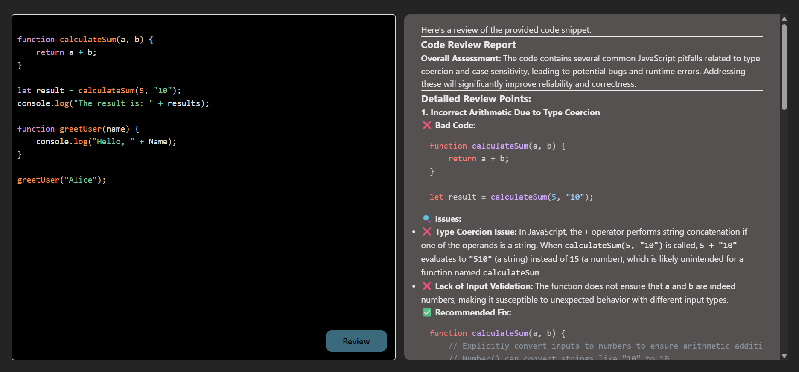

# 🤖 AI Code Reviewer

**AI Code Reviewer** is a modern and interactive full-stack web application built with the **MERN Stack** (MongoDB, Express, React, Node.js) that allows users to submit code for automated review. The app detects errors, suggests improvements, and provides AI-powered feedback for better coding practices. ⚡

---

## 📸 Screenshots

| Interface |
|-----------|
|  |

---

## 🔥 Features

✅ Submit code for AI-powered review  
✅ Detect coding errors and suggest improvements  
✅ Context-aware suggestions for optimized code  
✅ Integrated **code editor** in the frontend  
✅ Review system with organized data display  
✅ Clear system instructions for optimal AI performance  
✅ Fully **responsive design**  
✅ Modern UI styled with **CSS**  

---

## 🛠️ Tech Stack

**Frontend:**  
- ReactJS  
- CSS  

**Backend:**  
- Node.js  
- Express.js  
- MongoDB (Mongoose)  
- AI services integration  

---

## ⚙️ Installation & Setup

### 1. Clone the Repository

git clone https://github.com/USERNAME/AI-Code-Reviewer
cd AI-Code-Reviewer

### 2. Install Dependencies 

a. Backend
cd backend
npm install 

b. Frontend
cd frontend
npm install

### 2. Run the Application

a. Start Backend Server
cd backend
npx nodemon

b. Start Frontend Server
cd frontend
npm run dev
